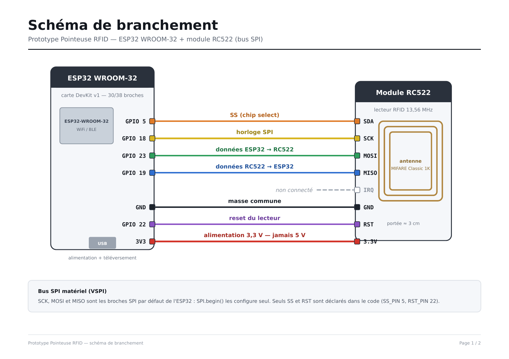
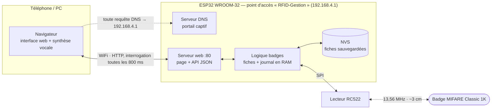
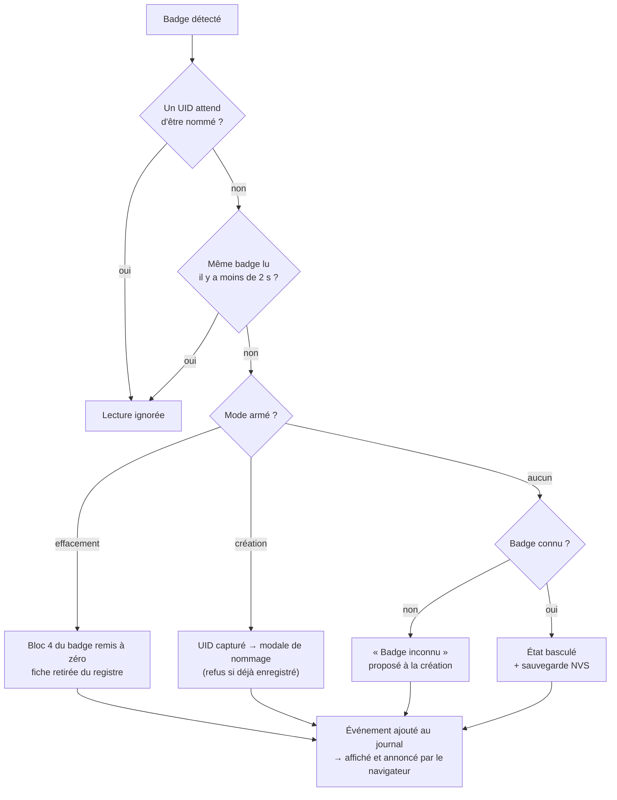
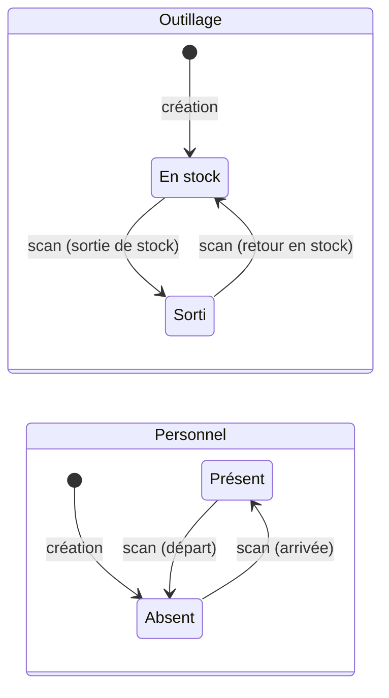
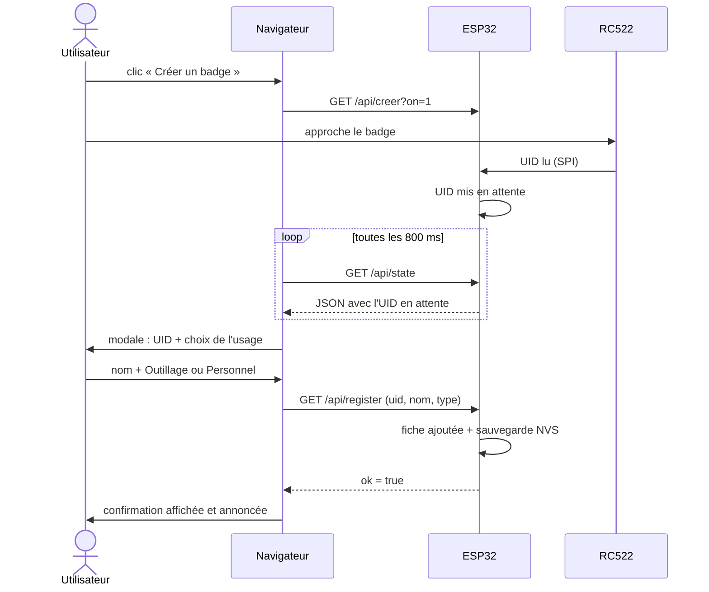

# Prototype Pointeuse RFID

Prototype de démonstration d'une **pointeuse et d'un suivi d'outillage par badge RFID**, entièrement autonome : l'ESP32 crée son propre réseau WiFi et héberge l'interface web. Aucun serveur, aucune connexion Internet, aucune application à installer — un navigateur suffit.

Un badge = un usage, choisi à sa création et définitif :

| Usage | 1er scan | 2e scan |
|---|---|---|
| **Outillage** | sortie de stock | retour en stock |
| **Personnel** | arrivée | départ |

Chaque mouvement est affiché dans le journal, annoncé vocalement par le navigateur (Web Speech API, fonctionne hors ligne) et enregistré en mémoire non volatile.

---

## Matériel

| Élément | Détail |
|---|---|
| Carte | ESP32 WROOM-32 (DevKit v1) |
| Lecteur | Module RFID RC522 — 13,56 MHz |
| Badges | MIFARE Classic 1K, clé A d'usine (`FF FF FF FF FF FF`) |
| Câblage | 7 fils Dupont femelle/femelle |
| Alimentation | USB 5 V (le RC522 est alimenté en **3,3 V** depuis la carte) |

## Câblage



| RC522 | ESP32 | Rôle |
|---|---|---|
| SDA (SS) | GPIO 5 | Sélection du composant sur le bus SPI |
| SCK | GPIO 18 | Horloge SPI |
| MOSI | GPIO 23 | Données ESP32 → RC522 |
| MISO | GPIO 19 | Données RC522 → ESP32 |
| IRQ | — | Non connecté (scrutation dans `loop()`) |
| GND | GND | Masse commune |
| RST | GPIO 22 | Réinitialisation du lecteur |
| 3.3V | 3V3 | Alimentation du module |

> **Le RC522 n'est pas tolérant au 5 V.** Le relier à VIN détruit le module.

Le schéma détaillé, avec les points de vigilance et la procédure de mise en service, est disponible en PDF : [`docs/schema-branchement.pdf`](docs/schema-branchement.pdf).

## Installation

1. **Arduino IDE** — ajouter le gestionnaire de cartes ESP32 :
   `Fichier → Préférences → URL de gestionnaire de cartes supplémentaires`
   ```
   https://espressif.github.io/arduino-esp32/package_esp32_index.json
   ```
   puis `Outils → Type de carte → Gestionnaire de cartes` → installer **esp32** (Espressif Systems).

2. **Bibliothèque** — `Outils → Gérer les bibliothèques` → installer **MFRC522** (Miguel Balboa).

3. **Téléverser** — ouvrir [`rfid_gestion/rfid_gestion.ino`](rfid_gestion/rfid_gestion.ino), sélectionner la carte *ESP32 Dev Module* et le port COM, puis téléverser. Moniteur série à **115200 bauds**.

Au démarrage, le moniteur série doit afficher :

```
RC522 VersionReg = 0x92
Charge : 0 fiches
AP "RFID-Gestion" -> http://192.168.4.1
Serveur pret.
```

Un `VersionReg` à `0x00` ou `0xFF` signale un problème de câblage ou de soudure.

## Utilisation

1. Se connecter au réseau WiFi **`RFID-Gestion`** — mot de passe **`badge1234`**.
2. Ouvrir **http://192.168.4.1** (un portail captif s'ouvre en général tout seul).
3. **Créer un badge** → approcher le badge du lecteur → lui donner un nom → choisir *Outillage* ou *Personnel*.
4. Chaque scan suivant bascule l'état et l'annonce à voix haute.
5. **Effacer un badge** remet à zéro le bloc de données du badge et le retire du registre.

L'heure est fournie par le navigateur au premier chargement de la page ; tant qu'aucun client ne s'est connecté, les horodatages affichent `--:--`.

## Fonctionnement

### Architecture

Tout tourne sur l'ESP32 : point d'accès WiFi, portail captif, serveur web et logique des badges. Le navigateur affiche l'interface et se charge de la synthèse vocale.



### Traitement d'un scan

Ce que fait `loop()` à chaque badge présenté :



### États d'un badge

L'usage est fixé à la création. Chaque scan fait basculer l'état.



### Création d'un badge

Le serveur ne pousse rien : le navigateur découvre l'UID scanné en interrogeant `/api/state`.



## Structure du dépôt

```
.
├── rfid_gestion/
│   └── rfid_gestion.ino        # sketch principal : AP WiFi + serveur web + logique RFID
├── examples/
│   └── test_lecteur/
│       └── test_lecteur.ino    # utilitaire série : lire / écrire un bloc d'un badge
├── docs/
│   ├── schema-branchement.pdf  # schéma de câblage et mise en service (2 pages)
│   └── schema-branchement.png  # version image du schéma
├── LICENSE
└── README.md
```

## API HTTP

L'interface web est servie depuis la mémoire du programme (`PROGMEM`) et interroge l'ESP32 toutes les 800 ms.

| Route | Paramètres | Effet |
|---|---|---|
| `GET /` | — | Page web complète |
| `GET /api/state` | — | État JSON : fiches, journal, modes armés, UID en attente |
| `GET /api/creer` | `on=0\|1` | Arme le mode création |
| `GET /api/effacer` | `on=0\|1` | Arme le mode effacement |
| `GET /api/register` | `uid`, `nom`, `type` | Enregistre un badge (`type` = `outil` ou `perso`) |
| `GET /api/delete` | `uid` | Retire une fiche du registre |
| `GET /api/annuler` | — | Annule la création en cours |
| `GET /api/time` | `epoch` | Règle l'horloge de l'ESP32 |

## Personnalisation

En tête de [`rfid_gestion.ino`](rfid_gestion/rfid_gestion.ino) :

```cpp
#define SS_PIN      5      // broche SDA du RC522
#define RST_PIN     22     // broche RST du RC522
#define BLOC_DATA   4      // bloc effacé par « effacer le badge »
#define MAX_FICHES  32     // nombre maximum de badges enregistrés
#define MAX_JOURNAL 30     // nombre d'événements conservés

const char* AP_SSID = "RFID-Gestion";
const char* AP_PASS = "badge1234";   // 8 caractères minimum
```

## Limites connues

- Prototype de démonstration : le mot de passe du point d'accès est en clair dans le code et l'interface web n'est pas protégée.
- 32 badges et 30 événements maximum, stockés en RAM ; seules les fiches sont sauvegardées en NVS.
- Le journal est perdu à chaque redémarrage.
- L'horloge est fournie par le premier navigateur connecté ; elle dérive et repart à zéro après une coupure.
- La synthèse vocale dépend du navigateur (Chrome et Edge donnent les meilleurs résultats en français).

## Licence

[MIT](LICENSE)
